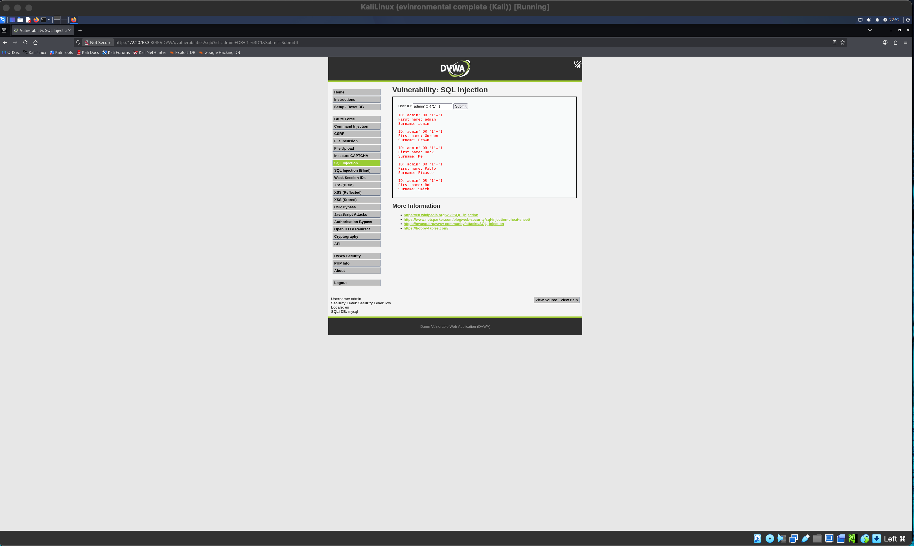
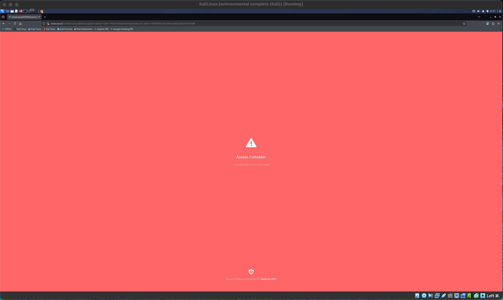
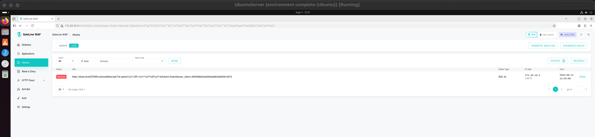
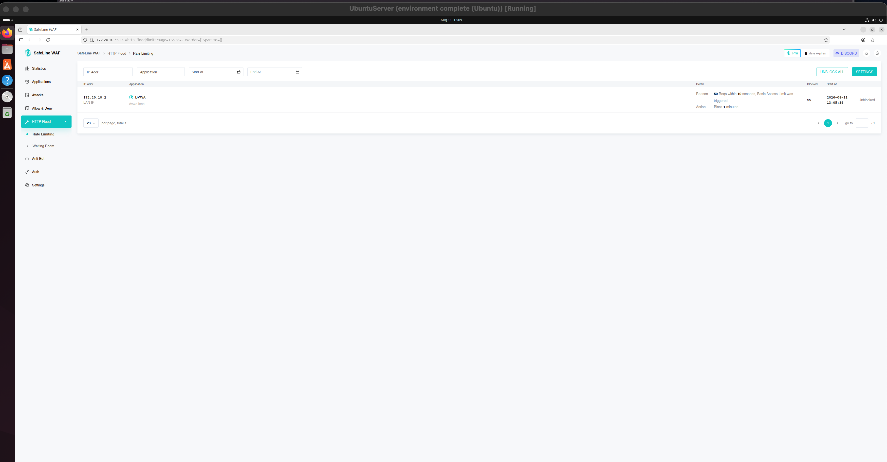
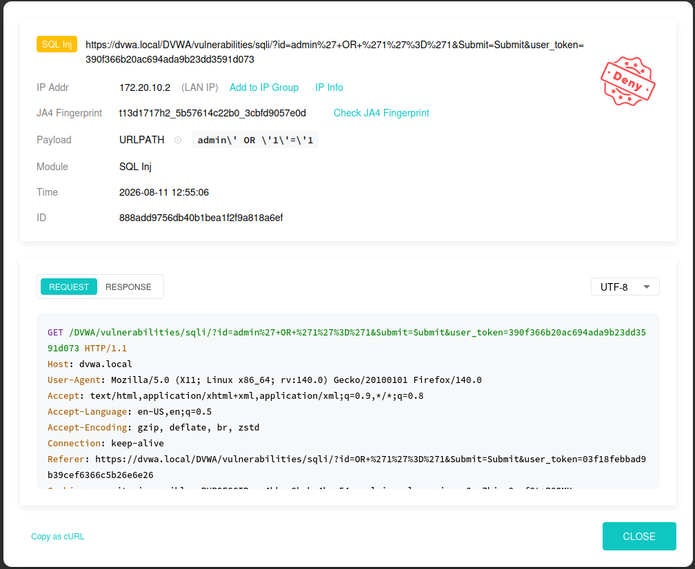
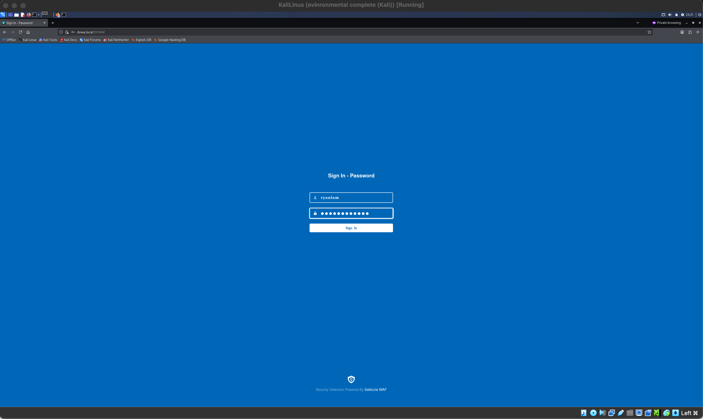

# Web Application Firewall Home Lab — SafeLine WAF

A hands-on attack-and-defend lab built to observe how a Web Application Firewall
detects and blocks web attacks against a deliberately vulnerable application.
The lab pairs an attacker machine (Kali Linux) against a target web server
(Ubuntu running DVWA), with SafeLine WAF placed in front as a reverse proxy.

The goal was not just to run an attack, but to demonstrate the difference
between an exploitable vulnerability and a blocked one — the same payload
succeeds when it reaches the app directly and fails when it passes through
the WAF.

> Built on an Apple Silicon (ARM64) Mac. The original guide this project was
> based on targets x86 hosts, so a significant part of the work was porting
> every component to ARM64 — see [Challenges](#challenges).

---

## Architecture

```
                          172.20.10.0/28  (bridged network)

   ┌──────────────┐         ┌──────────────────────────────────────┐
   │  Kali Linux  │         │            Ubuntu 24.04              │
   │  attacker    │         │              target                 │
   │ 172.20.10.2  │         │           172.20.10.3               │
   │              │  HTTPS  │  ┌────────────┐    ┌──────────────┐ │
   │  Firefox     │ ──443──▶│  │  SafeLine  │───▶│   DVWA       │ │
   │  ab / siege  │         │  │  WAF       │8080│  Apache/PHP  │ │
   │              │         │  │ (rev proxy)│    │  MySQL       │ │
   └──────────────┘         │  └────────────┘    └──────────────┘ │
                            │   console :9443                     │
                            └──────────────────────────────────────┘
```


Two paths to the same application:

| Path | URL | Goes through WAF? |
|------|-----|-------------------|
| Direct | `http://172.20.10.3:8080/DVWA/` | No — used to prove the vuln is real |
| Protected | `https://dvwa.local/DVWA/` | Yes — WAF inspects every request |

---

## Stack

| Component | Role | Details |
|-----------|------|---------|
| Kali Linux | Attacker | ARM64, `ab` / `siege` for load testing |
| Ubuntu 24.04 | Target host | ARM64 Desktop |
| DVWA | Vulnerable app | Apache 2.4 + PHP + MySQL 8 |
| SafeLine WAF | Reverse proxy WAF | Docker-based, listens on 443, upstream 8080 |
| VirtualBox 7.2 | Hypervisor | Apple Silicon build |

---

## What I did

1. **Built the virtual environment** — two ARM64 VMs on VirtualBox with a
   bridged network so attacker and target share a subnet.
2. **Deployed the vulnerable target** — installed a LAMP stack on Ubuntu and
   configured DVWA, running Apache on port 8080.
3. **Added TLS + reverse proxy** — generated a self-signed certificate and
   placed SafeLine WAF in front of DVWA, terminating HTTPS on 443 and proxying
   to the app on 8080.
4. **Proved the vulnerability** — ran a SQL injection from Kali against the
   direct path (bypassing the WAF) and dumped the user table.
5. **Demonstrated protection** — replayed the same payload through the WAF and
   watched it get blocked, then confirmed the attack was logged and classified.
6. **Explored WAF defense layers** — rate limiting, source-IP deny rules, and
   an authentication gateway.

---

## Results

### 1. SQL injection — direct path (no WAF)

Security level set to **Low**. Payload `admin' OR '1'='1` submitted to the
SQL Injection module via `http://172.20.10.3:8080/DVWA/`.

The always-true condition returns **every** user instead of one — the full
user table is dumped.



### 2. Same payload — through the WAF

Identical payload, this time via `https://dvwa.local/DVWA/`. SafeLine inspects
the request and returns **Access Forbidden** before it ever reaches DVWA.



### 3. The block, logged and classified

SafeLine records the blocked request, decodes the payload, and classifies it
as **SQL Injection** — with the source IP, timestamp, and full HTTP request.



**Key takeaway:** the WAF did not fix the vulnerability in DVWA's code — the
flaw is still there. It blocked the malicious request at the network layer
before it could reach the application. Same app, same payload, different path,
opposite outcome.

| | Path | Payload | Result |
|--|------|---------|--------|
| Direct | `:8080` (bypasses WAF) | `admin' OR '1'='1` | 5 users leaked |
| Protected | `dvwa.local` (via WAF) | `admin' OR '1'='1` | Access Forbidden |

---

## WAF defense layers

Beyond content inspection, I tested three more mechanisms — each blocks on a
different basis:

| Layer | Blocks based on | Demonstration |
|-------|-----------------|---------------|
| **Semantic detection** | Malicious *content* | SQLi payload blocked (above) |
| **Rate limiting** | Request *frequency* | Flood of 500 requests → IP throttled |
| **IP deny rule** | *Source* | All traffic from Kali blocked, even clean requests |
| **Auth gateway** | *Identity* | App hidden behind a WAF sign-in page |

### Rate limiting (HTTP flood)

Threshold set to 50 requests / 10 seconds. Load-tested from Kali with
`ab -n 500 -c 20 https://dvwa.local/DVWA/`. SafeLine detected the burst and
temporarily banned the source IP.



### IP deny rule

A deny rule matching source IP `172.20.10.2` blocks **all** traffic from Kali —
including requests with no malicious payload at all. This is filtering by
*source* rather than *content*.



### Authentication gateway

With the auth gateway enabled and bound to the DVWA application, the WAF places
its own sign-in page in front of the app. An unauthenticated attacker never
reaches DVWA's own login screen — the application is hidden entirely behind the
WAF.



---

## Challenges

The guide I followed was written for x86 hosts. Running it on an Apple Silicon
(ARM64) Mac meant almost every component needed adjusting — this is where most
of the actual learning happened.

- **VirtualBox on Apple Silicon.** The guide assumes x86 ISOs. I had to source
  ARM64 builds of Kali and Ubuntu, and Guest Additions required the
  `VBoxLinuxAdditions-arm64.run` installer rather than the default x86 one.

- **Ubuntu ISO wasn't on the main download page.** The ARM64 desktop image is
  only available under the release directory, not the primary download button —
  a common snag for Apple Silicon users.

- **DVWA broke on MySQL 8.** DVWA is written for MariaDB and uses
  `ADD COLUMN IF NOT EXISTS`, which MySQL 8 doesn't support. The setup page
  threw a fatal SQL syntax error. I traced it through the Apache error log and
  patched the DBMS include file to remove the unsupported clause.

- **MySQL password policy rejected the default.** MySQL 8's `validate_password`
  plugin refused DVWA's default credentials. I lowered the policy to match the
  lab's intentionally weak config.

- **Bridged networking landed on the wrong adapter.** The Ubuntu VM initially
  pulled a `10.0.2.x` NAT address instead of a bridged one, so the two VMs
  couldn't see each other. Fixing the adapter put both on the same
  `172.20.10.0/28` subnet.

- **SafeLine Community isn't supported on ARM.** Chaitin's docs state that
  SafeLine on ARM requires a Pro license; the free Personal edition is blocked.
  I evaluated the trade-off and used the Pro trial to complete the WAF portion.

- **Session dropped through the reverse proxy.** DVWA's login looped when
  accessed via HTTPS through the WAF (a forwarded-proto / cookie issue). Since
  the WAF inspects every request regardless of auth state, I demonstrated the
  SQLi block by sending the payload directly in the URL rather than logging in
  first.

---

## What I learned

- A WAF is a **compensating control**, not a fix. The underlying vulnerability
  in DVWA remained fully exploitable — the WAF simply stopped malicious
  requests from reaching it.
- Defense works in **layers**, and each layer filters on a different signal:
  content, frequency, source, and identity. A real deployment uses several at
  once.
- Reverse-proxy WAFs introduce their own operational concerns — TLS
  termination, forwarded headers, and session handling — that have to be
  configured correctly or they break the app they protect.
- Reading logs (Apache error log, WAF detection log) was essential to
  diagnosing every problem in this lab. The error message is usually more
  useful than the symptom.

---

## Lab notes

| Item | Value |
|------|-------|
| Attacker (Kali) | 172.20.10.2 |
| Target (Ubuntu) | 172.20.10.3 |
| DVWA via WAF | `https://dvwa.local/DVWA/` |
| DVWA direct (bypass) | `http://172.20.10.3:8080/DVWA/` |
| SafeLine console | `https://172.20.10.3:9443` |

Credentials are omitted intentionally. Never commit private keys, passwords,
or license codes to a public repository.

---

*This lab was built for educational purposes on an isolated network. DVWA is
deliberately vulnerable and should never be exposed to the internet.*
